<h3><code>yasser@github ~ $ ./contributions.sh</code></h3>

  

<h3><code>yasser@github ~ $ whoami</code></h3>
<table>
  <tr>
    <td valign="top"></td>
    <td valign="top"></td>
  </tr>
</table>

 

<h3><code>yasser@github ~ $ ls ~/projects</code></h3>

<table>
  <tr><th align="left">project/</th><th align="left">stack</th><th align="left">description</th></tr>
  <tr><td><a href="https://shipix.app"><code>shipix.app</code></a></td><td><code>next.js · laravel</code></td><td>SaaS store &amp; delivery management</td></tr>
  <tr><td><a href="https://algserv.app"><code>algserv.app</code></a></td><td><code>next.js · supabase</code></td><td>CV builder · invoices · auto-entrepreneur</td></tr>
  <tr><td><code>school-platform</code></td><td><code>laravel · vue</code></td><td>educational management system (INSFP)</td></tr>
  <tr><td><code>boutique-online</code></td><td><code>next.js · supabase</code></td><td>e-commerce with stock management</td></tr>
  <tr><td><code>yacinesms</code></td><td><code>laravel · flutter</code></td><td>SMS service application</td></tr>
</table>

 

<h3><code>yasser@github ~ $ cat contact.txt</code></h3>

  <a href="https://yasserhs.me"><code>yasserhs.me</code></a> ·
  <a href="https://github.com/yasxer"><code>github/yasxer</code></a> ·
  <a href="https://www.linkedin.com/in/yasserhaoues"><code>linkedin/yasserhaoues</code></a>

<code>exit 0</code>

